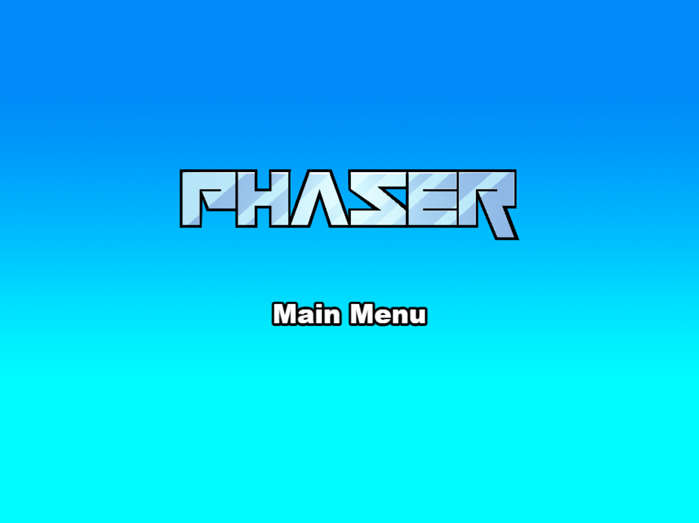

# Phaser Importmap Template

This is a Phaser 3 project template that uses [importmap](https://developer.mozilla.org/en-US/docs/Web/HTML/Element/script/type/importmap).

An import map is a JSON object that allows developers to control how the browser resolves module specifiers when importing JavaScript modules. It provides a mapping between the text used as the module specifier in an import statement or import() operator, and the corresponding value that will replace the text when resolving the specifier. The JSON object must conform to the Import map JSON representation format.

An import map is used to resolve module specifiers in static and dynamic imports, and therefore must be declared and processed before any <script> elements that import modules using specifiers declared in the map.

importmap a baseline 2023 feature. Please [see MDN](https://developer.mozilla.org/en-US/docs/Web/HTML/Element/script/type/importmap) for details about browser compatibility.

### Versions

This template has been updated for:

- [Phaser 3.70.0](https://github.com/phaserjs/phaser)



## Writing Code

After cloning the repo, you will need a server to serve the resources of your game. You can try using LiveServer, which is an extension for Visual Studio Code, or any other server of your choice. For more information, refer to the [Phaser Getting Started](https://phaser.io/tutorials/getting-started-phaser3) guide.

## Important notes about importmap

- You **MUST** use the `phaser.esm` build of Phaser. This is the only build that exports ES Modules that importmap supports.
- Phaser v3.60.0 was the first version to export an ESM bundle. You cannot use earlier versions with this template.
- The 'name' you give in the importmap (in your `index.html`) should match exactly that used in the `import` declarations within your game code.
- You can store the Phaser ESM build locally if you'd rather not use the CDN. Simply put the `phaser.esm.js` in your local folder structure and reference that inside your HTML like this: 

```js
{
    "imports": {
        "phaser": "./my-local-folder/phaser.esm.js"
    }
}
```

## Template Project Structure

We have provided a default project structure to get you started. This is as follows:

- `assets/` - Contains the static assets used by the game.
- `src/` - Contains the game source code.
- `src/scenes/` - The Phaser Scenes are in this folder.
- `src/main.js` - The main entry point. This contains the game configuration and starts the game.
- `index.html` - A basic HTML page to contain the game.
- `style.css` - Some simple CSS rules to help with page layout.

## Deploying to Production

In order to deploy your game, you will need to upload *all* the content of the folder to a public-facing web server.

## Join the Phaser Community!

We love to see what developers like you create with Phaser! It really motivates us to keep improving. So please join our community and show off your work 😄

**Visit:** The [Phaser website](https://phaser.io) and follow on [Phaser Twitter](https://twitter.com/phaser_)<br />
**Play:** Some of the amazing games [#madewithphaser](https://twitter.com/search?q=%23madewithphaser&src=typed_query&f=live)<br />
**Learn:** [API Docs](https://newdocs.phaser.io), [Support Forum](https://phaser.discourse.group/) and [StackOverflow](https://stackoverflow.com/questions/tagged/phaser-framework)<br />
**Discord:** Join us on [Discord](https://discord.gg/phaser)<br />
**Code:** 2000+ [Examples](https://labs.phaser.io)<br />
**Read:** The [Phaser World](https://phaser.io/community/newsletter) Newsletter<br />

Created by [Phaser Studio](mailto:support@phaser.io). Powered by coffee, anime, pixels, and love.

The Phaser logo and characters are &copy; 2011 - 2024 Phaser Studio Inc.

All rights reserved.
